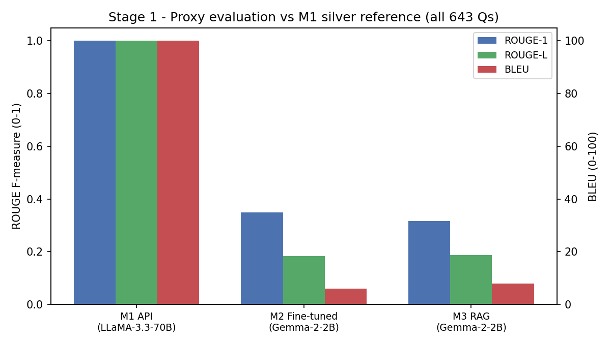
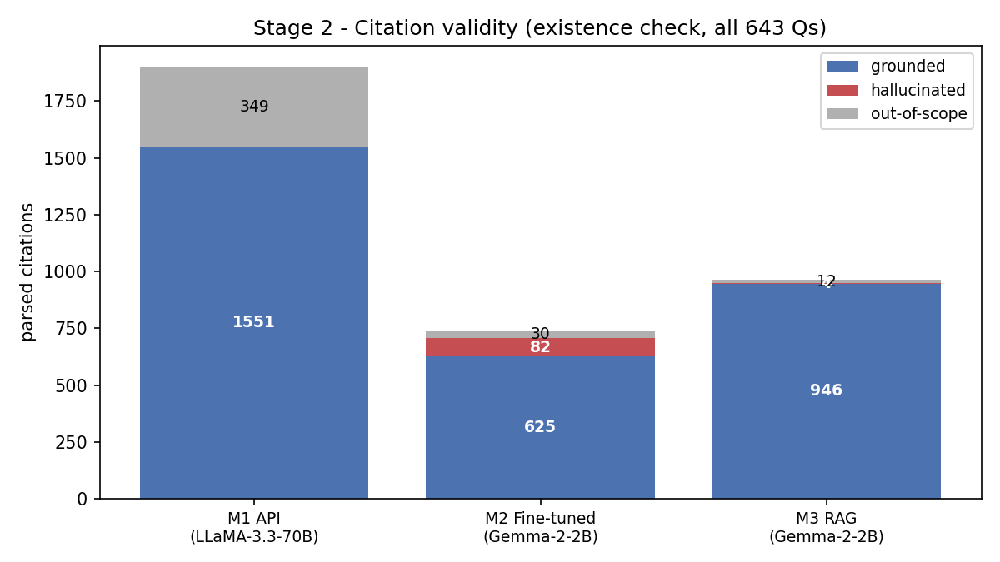
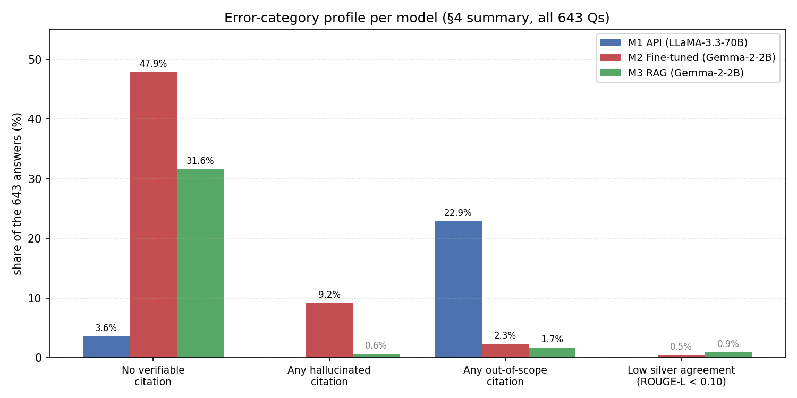
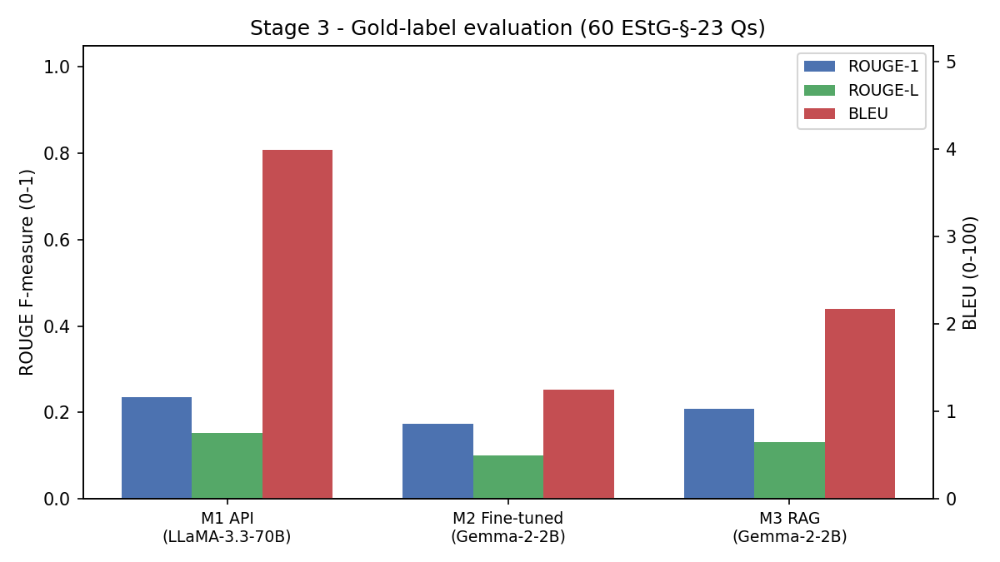

# Team 11 — Stage 3 Report
## Austrian Tax Law Q&A with Three LLM Approaches

**Course:** WU Wien 4805 Applications of Data Science — LLMs (SS26)
**Team:** Team 11 — Berkay Kaya
**Task:** Answer 643 Austrian tax-law questions in German using three different LLM setups (one with API, two without).
**Dataset:** `dataset_clean.csv` (643 questions, columns `id`, `prompt`).

> **Scope note.** §2–§3 use Model 1 as a **silver / pseudo-reference**
> because the shared annotation was not found in the first place and no gold answers
> were available at evaluation time. This measures lexical similarity between
> models, not legal correctness. §4 adds systematic error analysis including
> a **citation validity check** over all 643 questions that does not depend
> on any reference. The **Appendix** runs a final gold-label evaluation on
> the 60 EStG-§-23 questions for which human-written correct answers are
> available. The three layers — silver similarity, citation validity, gold
> match — triangulate the same model ranking from independent angles.

---

## 1. Models

| # | Name | Approach | Base model | Size | Inference runtime |
|---|------|----------|------------|------|-------------------|
| 1 | **API** | Zero-shot prompting via Groq API | `llama-3.3-70b-versatile` (Meta LLaMA-3.3) | 70 B params | local Mac (~32 min) |
| 2 | **Fine-tuned** | QLoRA supervised fine-tuning | `google/gemma-2-2b-it` | 2 B params | Kaggle T4 |
| 3 | **RAG** | Retrieval-augmented generation | `google/gemma-2-2b-it` + FAISS retriever | 2 B params | Kaggle T4 |

### 1.1 Model 1 — API (LLaMA-3.3-70B via Groq)
- **Pre-training data:** Meta's LLaMA-3 line, pre-trained on a multilingual web / books / code mix (see the official Meta model card for exact composition and token count; we did not audit this ourselves). No domain specialisation for Austrian tax law.
- **Hyper-parameters at inference:** `temperature=0.1`, `max_tokens=300`, zero-shot, German "legal expert" system prompt requiring citations like `(§ 7 Abs. 1 KStG)`.
- **Sampling approach:** near-greedy (low temperature), no top-p or top-k overrides.
- **Engineering:** 3-attempt retry, `sleep(0.3)` between calls, checkpoint every 50 questions.

### 1.2 Model 2 — Fine-tuned (Gemma-2-2B QLoRA)
- **Base model:** `google/gemma-2-2b-it`, instruction-tuned 2 B-parameter decoder pre-trained by Google on a large multilingual web / code / mathematics mix (see the official Google / Gemma model card for exact composition and token count).
- **Fine-tuning data — how it was built (rule-based pipeline, no API data):**
  1. Extract text from the three law PDFs (EStG, KStG 1988, UStG) and split on `§` markers. This yields **3 643 raw sections** in total (EStG ≈ 2 550, KStG ≈ 580, UStG ≈ 513).
  2. For each section, skip it if shorter than 50 characters and truncate to 2 000 characters if longer.
  3. Apply **10 German instruction/answer template pairs** (e.g. *„Was regelt {ref}?" → „Gemäß {ref} gilt Folgendes: {text}"*). For every surviving section the code picks `min(3, len(TEMPLATES)) = 3` templates at random (`random.sample`, seed `42`) and emits 3 Q/A pairs per section, giving a candidate pool of roughly 3 × 3 643 ≈ 10 900 pairs.
  4. The candidate pool is **shuffled and trimmed to 400** (`max_pairs=400` hard cap). Because of the shuffle, the final 400 pairs are expected to come from roughly 380–390 distinct sections (this is a statistical estimate from the `400 / 10 900` sampling rate, not a number logged by the notebook), each typically contributing only one pair — i.e. the training set is **a sparse random sample of the law**, not a systematic coverage of every paragraph.
- **No manual filtering.** The only filters are the length filter (≥ 50, ≤ 2 000 characters) in step 2; there is no hand-cleaning step. The resulting 400 pairs are noisy verbatim slices of the law — an important caveat for interpreting Model 2's behaviour.
- **Fine-tuning method:** QLoRA (4-bit NF4 base) + LoRA adapters with `trl.SFTTrainer`.
- **LoRA config:** `r=16`, `alpha=32`, `dropout=0.05`, `target_modules=["q_proj","v_proj"]`.
- **Training hyper-parameters:** 3 epochs, lr `2e-4`, per-device batch size 4, gradient accumulation 4 → **effective batch size 16**, `bf16=True`, single GPU (Kaggle T4), chat template `<start_of_turn>user/model`.
- **Inference:** greedy decoding (`do_sample=False`), `repetition_penalty=1.15`, `max_new_tokens=300`, checkpoint every 50 questions.

### 1.3 Model 3 — RAG (Gemma-2-2B + FAISS)
- **Retriever:** `sentence-transformers/paraphrase-multilingual-mpnet-base-v2` (768-dim multilingual sentence embedder). FAISS index built with `IndexFlatIP` and all embeddings L2-normalised at encode time (`normalize_embeddings=True`), i.e. **cosine similarity** — not Euclidean L2 as one might assume from the index name.
- **Indexed documents:** the three course law PDFs available in `context/Gesetze/`:
  - `EStG.pdf`
  - `KStG 1988 Fassung vom 03.04.2026.pdf`
  - `UStG.pdf`
- **Pre-processing / chunking:** text extracted with **PyMuPDF** (`fitz.open(pdf).get_text()`), split on `§` markers, chunks capped at ~2 000 characters, metadata `{law, section, text}`.
- **Keyword pre-filter:** `detect_law(question)` scans the question for keywords of `EStG` / `KStG` / `UStG` and boosts chunks from the matching law before dense retrieval.
- **Top-k:** **5** retrieved passages are concatenated into the prompt for the generator.
- **Generator:** same `gemma-2-2b-it` in 4-bit NF4, greedy decoding (`do_sample=False`), `repetition_penalty=1.15`, `max_new_tokens=300`.
- **Retrieval validation:** sanity-checked on the **first 20** questions of the dataset (not hand-picked) before running the full 643.

> **Corpus gap — important.** The 643 questions touch more laws than what our
> RAG indexed. Questions refer to e.g. **GrEStG** (real-estate transfer),
> **EStR 2000** (the tax administration guidelines), **ABGB** (civil code) and
> **GewO** (trade regulation). None of these are in the FAISS index — only
> EStG, KStG and UStG are. Model 3 is therefore structurally disadvantaged on
> any question whose authoritative source lies outside those three files,
> and we see the symptom in §4.3.

---

## 2. Evaluation setup

### 2.1 Proxy evaluation
The task has no reference answers and the shared annotation round did not happen. We therefore treat the **largest** model — Model 1 (LLaMA-3.3-70B via Groq) — as a **silver / pseudo-reference** and measure how close the two 2 B models get to it. Concretely, this means:

- **We are not measuring legal correctness.** We are measuring *stylistic and lexical similarity to Model 1's output.* Wherever Model 1 itself is wrong, the "silver" is wrong too.
- Model 1 trivially scores perfectly against itself (not informative), so the main comparison is Model 2 vs Model 3.
- We additionally report a **symmetric pairwise similarity** between every pair of models (§3.2), which does not privilege Model 1 — but still remains a similarity measure, not a correctness measure.

> **Relation to the Stage-3 brief.** The course slides explicitly mention
> annotation-based accuracy as a reference example for Stage 3. A proper
> annotated evaluation was not possible because the shared annotation round
> did not take place and we do not have a tax-law expert in the team. The
> silver-reference setup below is therefore a **workaround under missing gold
> labels, not the ideal Stage-3 evaluation.** A full accuracy / annotation
> evaluation would require (a) human tax-law annotators and (b) a **semantic**
> citation-correctness metric — on top of the existence check we already run
> in §4.2 — that verifies each `§` is actually the right norm for the
> question (§2.4 layer 3). Both are out of scope for this submission but
> would be the natural next steps.

### 2.2 Metrics
- **ROUGE-1 / ROUGE-2 / ROUGE-L** (F-measure) via `rouge_score` — word and longest-common-subsequence overlap. F-measure is symmetric under pred/ref swap, so it is safe to aggregate both directions.
- **BLEU** via `sacrebleu` with `tokenize="intl"` — corpus-level, 0–100 scale. BLEU is **directional** (one side is treated as prediction, the other as reference), so in the pairwise table we compute it in both directions and report the mean; both raw directional values are kept in the CSV for transparency.
- **Intrinsic descriptors:** average answer length (chars, words); average count of `§` symbols per answer; share of answers that contain at least one `§` (citation coverage). These matter in a legal setting because an answer without paragraph references is practically unusable, but the metric is **crude** — it counts `§` characters, it does **not** verify that the cited norm exists or is relevant, and it does not detect alternative citation styles like *"EStR 2000 Rz 1234"*.
- **BERTScore** was planned but requires `torch`, which has no Python-3.13 x86_64 wheel in our local environment. `evaluation.py` contains the exact BERTScore snippet (`BERTSCORE_NOTE`) so it can be re-run on Colab / Kaggle and the numbers pasted into this report.

### 2.3 Evaluation scripts / pipeline

The evaluation is a four-stage pipeline; each stage has its own script and
writes its outputs into `results/` (figures into `results/visualizations/`).
Stage 2 (error analysis) is **jointly
implemented by two scripts** — we did not add a separate `error_analysis.py`
because `evaluation.py` already emits the per-question ROUGE-L matrix that
the low-agreement ranking is built from.

| Stage | Script | Feeds | Outputs |
|---|---|---|---|
| 1 — broad proxy evaluation, all 643 Qs | `evaluation.py` | §3 + §4.1 / §4.3 / §4.4 | `evaluation_main_table.csv`, `evaluation_pairwise.csv`, `evaluation_per_question.csv`, `evaluation_error_analysis.md` |
| 2 — systematic error analysis, all 643 Qs | jointly: `evaluation.py` (low-agreement ranking) + `citation_check.py` (citation validity) | §4 (esp. §4.2) | the four files above **plus** `citation_check_summary.csv`, `citation_check_per_answer.csv` |
| 3 — final stricter validation, 60 Qs | `evaluation_gold.py` | Appendix A | `evaluation_gold_table.csv`, `evaluation_gold_per_question.csv` |
| 4 — report-ready figures | `visualize_results.py` | §3, §4, Appendix | `visualizations/fig_main_results.png`, `visualizations/fig_citation_validity.png`, `visualizations/fig_gold_results.png`, `visualizations/fig_error_profile.png` |

Reproduce the whole pipeline with the orchestrator:
```bash
cd Berkay_Kaya/codes
python3 run_all_evaluations.py
```
Or run the stages individually (`python3 evaluation.py`, `python3 citation_check.py`, `python3 evaluation_gold.py`, `python3 visualize_results.py`).

### 2.4 Three layers of citation checking

Because the citation metrics are easy to confuse, we spell out the three
layers explicitly — readers should keep them separate:

1. **§3.1 — simple `§`-count.** Counts the `§` character per answer and the
   share of answers containing at least one `§`. Does **not** verify that the
   cited paragraph exists; it is a surface indicator of citation *habit*.
2. **§4.2 — citation-validity existence check.** Parses every
   `§ X … <lawname>` pair and checks whether that § number actually exists in
   the named law's PDF. Catches fabricated numbers. Does **not** check whether
   the § is the correct norm for the question.
3. **Still missing — semantic citation correctness.** Whether the cited § is
   the *right* paragraph for the question. Requires human legal annotation and
   is out of scope for this submission. §4.3 illustrates it anecdotally; §4.7
   repeats it as a caveat.

---

## 3. Results

### 3.1 Main result table (prediction = row, reference = Model 1)

| Model | ROUGE-1 | ROUGE-2 | ROUGE-L | BLEU | Avg chars | Avg words | §/answer | % answers with § |
|---|---|---|---|---|---|---|---|---|
| Model 1 — API (LLaMA-3.3-70B) | 1.000 | 1.000 | 1.000 | 100.00 | 883 | 126 | 3.21 | 100.0 % |
| Model 2 — Fine-tuned (Gemma-2-2B) | **0.348** | **0.108** | 0.184 | 5.99 | 1257 | 163 | 1.28 | 57.4 % |
| Model 3 — RAG (Gemma-2-2B) | 0.317 | 0.105 | **0.186** | **7.88** | 779 | 105 | **2.35** | **94.1 %** |

Model 1 is 1.0 by definition because it is the reference. The meaningful comparison is Model 2 vs Model 3. Note that Model 2 leads on ROUGE-1 but loses on every stricter metric — discussed in §5.

*On citation metrics:* the `§/answer` and `% answers with §` columns here are the **surface `§`-count** from §2.4 layer 1 — they count the `§` character and do **not** verify that the cited paragraph exists. The stricter existence check lives in §4.2.



### 3.2 Symmetric pairwise similarity (no reference privileged)

| Model A | Model B | ROUGE-1 | ROUGE-2 | ROUGE-L | BLEU (mean) | BLEU A→B | BLEU B→A |
|---|---|---|---|---|---|---|---|
| M1 API | M2 Fine-tuned | 0.348 | 0.108 | 0.184 | 5.71 | 5.43 | 5.99 |
| M1 API | M3 RAG | 0.317 | 0.105 | 0.186 | 7.88 | 7.88 | 7.88 |
| M2 Fine-tuned | M3 RAG | 0.333 | 0.104 | 0.179 | **10.95** | 11.49 | 10.42 |

The two Gemma-based models agree with each other more (mean BLEU 10.95) than either agrees with the LLaMA model — unsurprising, since they share the same base model, vocabulary and chat template.

---

## 4. Error analysis

We ranked the 643 questions by the mean of `(ROUGE-L M2 vs M1, ROUGE-L M3 vs M1)` and inspected the 10 questions with the **lowest agreement to the silver reference**. The full dump is in `results/evaluation_error_analysis.md`. Important framing: "low agreement to M1" is **not the same as** "wrong" — it is disagreement with the silver, nothing more. All concrete legal judgments below are our own reading, not evaluation output. §4.8 closes the section with a visual summary of the error categories used throughout.

### 4.1 Direct disagreements in yes/no direction
- **`SELF-077` — *"Sind Trinkgelder steuerpflichtig?"*** — M1 answers *"ja, steuerpflichtig"* (citing `§ 25 Abs. 1 Z 1 EStG` and then noting an exception under `§ 3 Abs. 1 Z 13 EStG`), M2 also says *ja*, while M3 says *nein, nicht steuerpflichtig*. All three answers are on shaky ground — the actual Austrian rule (Trinkgelder are in principle part of income but specifically exempted under `§ 3 Abs. 1 Z 16a EStG` under certain conditions) is captured by none of them perfectly. M3 is the only one that flips the yes/no direction and would almost certainly mislead a practitioner.
- **`EMP-005` — freiwillige Abgangsentschädigung** — M1, M2 and M3 all agree in outcome (*steuerpflichtig*) but cite wildly different paragraphs.

### 4.2 Citation hallucination — systematic count (all 643 questions)

The §3.1 `% answers with §` metric only checks whether a `§` character appears anywhere in the answer. It cannot tell whether the cited paragraph number actually exists in the named law. We therefore built a paragraph index from the three indexed PDFs (EStG → 257 distinct §, KStG → 79, UStG → 58) and parsed every citation of the form `§ X … <lawname>` from all 1 929 answers (643 × 3 models). Each citation is classified as:

- **grounded** — law is EStG / KStG / UStG **and** the § number occurs in that PDF,
- **hallucinated** — law is EStG / KStG / UStG **but** the § number does not occur in that PDF,
- **out_of_scope** — cited law is something we did not index (ABGB, GewO, GrEStG, BAO, …).

Reproduce with:
```bash
cd Berkay_Kaya/codes
python3 citation_check.py
```

**Results:**

| Model | Answers with ≥ 1 cite | § parsed | Grounded | Hallucinated | Out-of-scope | **Grounded rate of verifiable** |
|---|---:|---:|---:|---:|---:|---:|
| Model 1 — API (LLaMA-3.3-70B) | 96.4 % (620/643) | 1 900 | 1 551 | **0** | 349 | **100.0 %** |
| Model 3 — RAG (Gemma-2-2B) | 68.4 % (440/643) | 962 | 946 | **4** | 12 | **99.6 %** |
| Model 2 — Fine-tuned (Gemma-2-2B) | 52.1 % (335/643) | 737 | 625 | **82** | 30 | 88.4 % |

The "grounded rate of verifiable" is the share of correct §-numbers among those whose target law is in our index (out-of-scope ones can neither be confirmed nor refuted).

**Interpretation.** This is the single most decisive result in the entire evaluation. Model 2 produces **82 hallucinated paragraph numbers** (12 % of its verifiable citations) — it confidently writes `§ X EStG` for numbers that do not exist in the EStG. Model 3 makes this mistake only 4 times; Model 1 zero times.

The gap plausibly reflects the underlying mechanism of each model. Model 1's pattern of emitting existing § numbers is consistent with a much larger backbone (70 B vs 2 B) and, presumably, more Austrian legal text in pretraining — but we did not audit Meta's training composition and cannot claim this directly. Model 3 lifts the § straight out of the retrieved PDF chunk, so as long as retrieval landed on *any* real chunk, the § is real. Model 2 has only a LoRA adapter on 400 noisy template-based pairs — it learned the *shape* of a citation ("§ <number> EStG") but not *which* numbers are real, and frequently fabricates plausible-looking but non-existent ones.

Most of Model 1's 349 out-of-scope citations name laws that **look like** real Austrian statutes we did not index (ABGB, GewO, GrEStG, BAO, …); spot-checking confirmed several but we did not verify every one. The 100 % grounded rate for Model 1 should therefore be read as an **upper bound conditional on our index coverage**, not as an independently verified zero-hallucination claim.

**What this check does NOT catch.** This is §2.4 layer 2 — an **existence** check. Grounded means the § *exists* in the law, not that it is the *right* § for the question. `§ 81 EStG` exists, so it counts as grounded, but if the question is about "Einkommen aus nichtselbständiger Arbeit" the correct norm is `§ 25 EStG`. Detecting such misattributions is §2.4 layer 3 — semantic citation correctness — which requires human annotation; specific examples are in §4.3 below.



**Regex limits.** We parse `§ <number> … <lawname>` within an 80-character window. A `§` without a law name in the same sentence is not counted — which is why `answers with ≥ 1 cite` here (68 % for M3) is stricter than the §3.1 `% with §` number (94 %). Both are informative: §3.1 says "mentions a §", §4.2 says "emits a verifiable § + law pair".

### 4.3 Citation hallucination — specific examples
The systematic count above captures cases where the § number does not exist. But there is a harder failure: § numbers that exist but are attached to the wrong topic (misattribution). These require human reading to detect. The following are paragraph references produced by the 2 B models that we could not match to the correct norm — confident misattributions picked from the low-agreement set:

- **`TAX-INTL-031`** — M3 cites `§ 57 Abs. 4 BAd` (not an actual Austrian norm we could locate) and `§ 25 EStG` with a mismatched interpretation.
- **`EStG-23-036`** — M3 cites `§ 81 EStG` for *"Einkommen aus nichtselbständiger Arbeit"*; the well-known norm for that concept is `§ 25 EStG`. (§ 81 EStG itself exists, so §4.2's automated check misses it.)
- **`EStG-23-038`** — M3 cites `§ 2 UStG` for a Gewerbebetrieb question; `§ 2 UStG` defines the VAT concept of *Unternehmer*, not *Gewerbebetrieb*, which lives in the GewO / EStG.
- **`GRESt-AT-035`** — M2 cites `§ 10 Abs. 2 EStG` for a GrEStG question, i.e. the wrong statute entirely.

Together, §4.2 (existence check) and §4.3 (misattribution examples) describe two layers of the same failure mode: the 2 B models look authoritative because they emit `§ X Gesetz` strings, but the references are either fabricated outright (M2) or misattributed to the wrong norm (M3).

### 4.4 Out-of-corpus questions (a RAG structural limit)
- **`SELF-047` — *"Was ist ein Dienstvertrag gemäß ABGB § 1151?"*** — M3 replies *"Der Text enthält keine Informationen…"*. This is **not a model bug** — it is a direct consequence of §1.3's corpus gap. We only indexed EStG, KStG, UStG, so a question about the ABGB (civil code) retrieves nothing useful and the generator refuses. The dataset appears to contain questions referring to GrEStG, EStR 2000, ABGB and GewO as well, which are all out-of-corpus for our RAG pipeline. Indexing those additional sources would be the first improvement to try.

### 4.5 Verbosity / padding (Fine-tuned only)
Model 2 averages 1 257 characters per answer vs. 883 for Model 1. The extra content is mostly generic framing (*"Als Experte für österreichisches Steuerrecht kann ich Ihnen sagen …"*) wrapped around a short actual answer. This is consistent with having been trained on only 400 template-instantiated `§`-slice pairs with no human cleanup: the model learned a generic answering *tone* but not tight domain-specific phrasing. It hurts BLEU and ROUGE-L because phrase order drifts, but it inflates ROUGE-1 for the mechanical reason noted in §5.

### 4.6 Shared mistake patterns
Partly. **Both** small models struggle on the same three question types:
- multi-paragraph legal reasoning (`EMP-036` — Treuebonus vs. Arbeitslohn),
- questions whose surface wording points at the wrong law (`GRESt-AT-035`, `EStG-23-038`),
- questions whose authoritative source is not in our RAG index (`SELF-047` ABGB).

But the **style** of failure differs:
- Model 2 (fine-tuned) tends to **hedge and pad**. It rarely commits to a wrong `§` because it rarely commits to a `§` at all.
- Model 3 (RAG) tends to **confidently emit a `§`** even when retrieval landed on the wrong chunk. Its higher citation coverage comes with a matching increase in confident-but-wrong references.

Model 1 is not reliably better on these same questions — we just *cannot measure* its errors with the current methodology, because it is the reference.

### 4.7 Honest caveats on the evaluation methodology
- **No gold labels for most of the dataset.** Using Model 1 as a silver reference implicitly rewards models that sound like LLaMA-3.3-70B. The main §3 numbers should be read as "similarity to M1", not "correctness". The Appendix (Gold Label Evaluation) attacks this gap for 60 of the 643 questions.
- **Surface metrics.** ROUGE and BLEU are lexical. Two legally equivalent answers with different wording score badly. BERTScore (`bert-base-multilingual-cased`) would partially fix this and is scripted in `evaluation.py` for a follow-up run on Colab/Kaggle.
- **Citation check catches existence, not relevance.** §4.2 verifies that the cited § number appears in the cited law, across all 643 questions. It does *not* verify that the § is the correct norm for the question — that requires human annotation. Examples of such misattributions are discussed anecdotally in §4.3.
- **BLEU is directional.** The pairwise table therefore reports a symmetric mean plus both raw directional values; please read the symmetric mean as the headline number.
- **RAG corpus gap.** Only EStG / KStG / UStG are indexed, while the dataset references more laws. Some questions are structurally unanswerable for Model 3 regardless of generator quality, and 349 + 30 + 12 citations fall into the "out-of-scope" bucket because we do not have the relevant PDFs.
- **Error-analysis ranking ≠ error labelling.** The qualitative top-10 in §4.3 are the questions on which M2/M3 disagree most with M1. Whether any of those three is actually legally correct would require human annotation by someone with a tax-law background. The specific legal judgments in §4.1 and §4.3 are our best-effort reading of the Austrian statutes we could consult and should not be treated as ground truth.

### 4.8 Error-category profile (summary figure)



The figure collects the whole error analysis into one view. Each bar is the share of the 643 answers that fall into an interpretable, deterministically computed error category — every value comes directly from the Stage 3 CSVs (`citation_check_summary.csv`, `citation_check_per_answer.csv`, `evaluation_per_question.csv`) with no hand-labelling. The four categories correspond to the §4 subsections above:

- **No verifiable citation** (§4.2, §4.5) — the answer contains no parseable `§ X … <lawname>` pair. Model 2 fails this on 47.9 % of answers, Model 3 on 31.6 %, Model 1 on 3.6 %.
- **Any hallucinated citation** (§4.2) — at least one § number that does not exist in the named, indexed law. Model 2 on 9.2 % of answers; Model 3 on 0.6 %; Model 1 zero (within our index).
- **Any out-of-scope citation** — at least one citation to a law we did not index (ABGB, GewO, GrEStG, BAO, …). Model 1 on 22.9 % of answers; both 2 B models much lower (≈ 2 %) because they mostly cite the three laws that are in the RAG corpus / fine-tune slices.
- **Low silver agreement** (§4.1, §4.3) — per-question ROUGE-L vs M1 below 0.10 (a chosen analytical threshold, not a natural ground-truth boundary). Both 2 B models are at ≤ 1 %; M1 is 0 % by construction.

Read together with §4.2 and §4.5, the profile makes each model's dominant failure mode visible at a glance: Model 2 *refuses or pads* and when it does cite, it often fabricates; Model 3 *retrieves reliably* but only within the three indexed laws; Model 1's "errors" in this table are mostly the **coverage limit** of our citation index, not fabrications.

---

## 5. Which model performs best?

**Caveat first.** We cannot make a global "best model" claim because Model 1 is set as the silver reference and is therefore not fairly comparable to the other two. The meaningful question is:

> **Among the two locally-hostable 2 B approaches, which looks better in the silver-reference setup?**

Under that framing, **Model 3 (RAG) is the stronger of the two**, for four reasons:

- Highest **BLEU vs. silver** (7.88 vs. 5.99) and marginally higher **ROUGE-L** — its phrasing is closest to the LLaMA-3.3-70B silver.
- **94 %** of answers contain at least one `§` — almost matching Model 1's 100 % and far above Model 2's 57 %. *(Caveat: the metric counts `§`, not whether the citation is correct; see §4.2.)*
- Average length (779 chars) is closest to the silver (883 chars), whereas Model 2 is 42 % longer — a symptom of over-generation / padding, not of richer content.
- Model 2 leads only on **ROUGE-1** (0.348 vs 0.317). ROUGE-1 rewards a larger unigram pool, so any answer that is longer and more verbose gets a mechanical boost. On ROUGE-2, ROUGE-L and BLEU — which reward phrase order — Model 2 loses.

**Interpretation.** With a 2 B-param backbone and only ~400 noisy synthetic Q&A pairs, QLoRA fine-tuning did not teach Gemma to reliably name Austrian tax paragraphs — it drifts into generic explanations and padding. Retrieval, in contrast, puts the actual law text directly into the prompt window, so the model can lift the `§` number straight out of the context. The gap in citation coverage (94 % vs 57 %) is the single clearest signal in the whole evaluation. The §4 error analysis confirms and deepens this picture: Model 2's hallucination rate (9.2 % of answers) and near-50 % citation-omission rate are the most concrete quantitative signal of what "not learning paragraph numbering" looks like in practice.

> **None of this implies that Model 3 produces *correct* legal answers.** It
> only means Model 3 *sounds* closer to Model 1 and mentions paragraphs more
> often. The gold-label evaluation in the Appendix confirms the M1 > M3 > M2
> ranking independently, using human-written reference answers for the 60
> EStG-§-23 questions.

---

## 6. Files in this submission

```
Berkay_Kaya/
├── REPORT.md                           ← this file
├── codes/
│   ├── model1_api_inference.ipynb      (Stage-2 model inference — unchanged)
│   ├── model2_finetune.ipynb           (Stage-2 model inference — unchanged)
│   ├── model3_rag.ipynb                (Stage-2 model inference — unchanged)
│   ├── evaluation.py                   ← Stage 1 — broad proxy evaluation (§3); also
│   │                                      feeds Stage 2 via per-question ROUGE-L
│   ├── citation_check.py               ← Stage 2 — systematic citation validity (§4.2)
│   ├── evaluation_gold.py              ← Stage 3 — gold-label evaluation (Appendix A)
│   ├── visualize_results.py            ← Stage 4 — figures from the final CSVs
│   └── run_all_evaluations.py          ← orchestrator (runs Stages 1-4 in order)
└── results/
    ├── model1_api_results.csv          (Stage-2 output)
    ├── model2_finetuned_results.csv    (Stage-2 output)
    ├── model3_rag_results.csv          (Stage-2 output)
    ├── evaluation_main_table.csv       ← §3.1
    ├── evaluation_pairwise.csv         ← §3.2 (symmetric mean + raw directions)
    ├── evaluation_per_question.csv     ← §3.2 / §4 ranking input
    ├── evaluation_error_analysis.md    ← §4.1 / §4.3 (top-10 lowest-agreement)
    ├── citation_check_summary.csv      ← §4.2
    ├── citation_check_per_answer.csv   ← §4.2
    ├── gold_labels_EStG23.csv          ← Appendix A (shared gold labels, all teams)
    ├── evaluation_gold_table.csv       ← Appendix A
    ├── evaluation_gold_per_question.csv ← Appendix A
    └── visualizations/
        ├── fig_main_results.png        ← §3.1 figure
        ├── fig_error_profile.png       ← §4 summary figure (error-category profile)
        ├── fig_citation_validity.png   ← §4.2 figure
        └── fig_gold_results.png        ← Appendix A figure
```

**Note on `error_analysis.py`.** We did not create a separate
`error_analysis.py`. Stage 2 (error analysis) is jointly implemented by
`evaluation.py` (per-question ROUGE-L matrix + top-10 lowest-agreement dump)
and `citation_check.py` (systematic citation validity). Splitting the
low-agreement ranking into its own script would duplicate the ROUGE
computation already done by `evaluation.py`.

---

## Appendix — Gold Label Evaluation

> **Motivation.** §3 (broad proxy, all 643 Qs) and §4 (systematic error
> analysis, all 643 Qs) both evaluate without human-written reference answers.
> This appendix runs the final stricter check: we measure each model against
> human-written gold answers for the 60 EStG-§-23 questions for which the
> course provides them. It is the narrowest stage of the pipeline but the
> closest approximation to correctness available in this project.

### A.1 Gold Label Evaluation (60 EStG-§-23 questions)

We re-evaluate the three models
against those gold answers: a fundamentally stronger test than the silver
reference in §2, because it measures proximity to *correct* legal content.

Reproduce with:
```bash
cd Berkay_Kaya/codes
python3 evaluation_gold.py
```

**Results against gold labels:**

| Model | ROUGE-1 | ROUGE-2 | ROUGE-L | BLEU |
|---|---|---|---|---|
| Model 1 — API (LLaMA-3.3-70B) | **0.234** | **0.078** | **0.152** | **3.99** |
| Model 2 — Fine-tuned (Gemma-2-2B) | 0.174 | 0.036 | 0.101 | 1.25 |
| Model 3 — RAG (Gemma-2-2B) | 0.208 | 0.051 | 0.132 | 2.18 |



**Interpretation.** The ranking is **M1 > M3 > M2 on every metric** — the same order the silver-reference setup produced in §3 and the citation check in §4.2. Three independent methodologies pointing at the same ranking is the strongest claim we can make about model ordering without human annotation.

The absolute scores look low because the gold answers are concise (2–4 sentences, ≈300–500 chars) while the model outputs average 779–1 257 chars. BLEU/ROUGE penalise this length mismatch even when the model's content is factually correct, so these numbers are best read as **relative comparisons**, not absolute accuracy percentages.

Model 1 leading is expected — a 70 B-parameter model with strong multilingual pre-training produces answers closest to the gold phrasing. Model 3 beats Model 2 by a consistent margin (R1 +0.034, RL +0.031, BLEU +0.93): retrieving the actual § 23 EStG text and placing it in the prompt produces tighter, more on-topic phrasing than a LoRA fine-tune on 400 synthetic pairs.

**Limitations of this sub-evaluation.**
- **Subset only.** The 60 gold questions cover only EStG § 23 (Gewerbebetrieb). Results may not generalise to the other 583 questions which span UStG, KStG, GrEStG, ABGB, etc.
- **Surface metrics remain.** ROUGE/BLEU reward lexical overlap; a legally equivalent but differently worded answer is penalised.
- **Single reference.** One reference answer per question — legal questions often admit multiple correct phrasings, so BLEU against a single short reference is conservative.

These results support a robust ranking across the three approaches, but they do not suggest that any of the models is already strong enough for reliable legal question answering in practice.